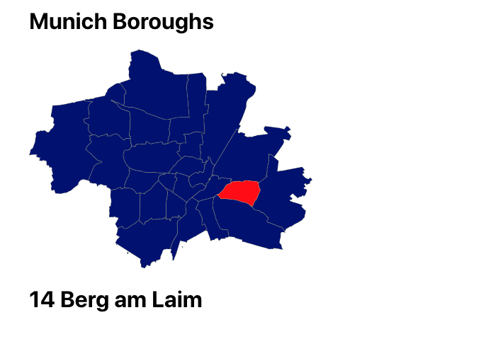

# react-borough-map-munich

Interactive borough map of Munich with SVG and React.



[**Access the application here.**](http://www.react-borough-map-munich.com.s3.eu-central-1.amazonaws.com/index.html)

For more information see my blog:

https://www.tderflinger.com/en/interactive-svg-map-munich

## Run

```
yarn
```

and

```
yarn start
```

## Overpass Turbo Query

```
// Time-out hochsetzen
[out:json][timeout:300];

{{geocodeArea:Hannover}}->.searchArea;

(
  // Nur Elemente vom Typ "Relation" abfragen.
  relation["boundary"="administrative"]["admin_level"="9"](area.searchArea);
);

out body;
>;
out skel qt;
```

## License

MIT License
